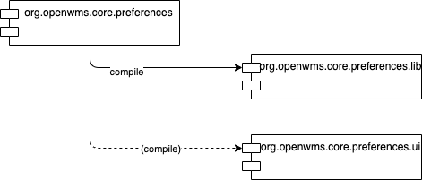

# Purpose
The OpenWMS.org Preferences Service deals with configuration and preferences for the whole application. It can be used to store
configuration parameters in different validity scopes. Scopes can be merged and inherited. Preferences might be stored only valid for a
particular *User* or a specific *Role*, specific to a *Module* (aka microservice) or the whole *Application*.  

# Resources

| Module      | Build Status                                                                                                                                                                                                                | Quality | License | Maven Central                                                                                                                                                                 | Docker Hub | Chat |
|-------------|-----------------------------------------------------------------------------------------------------------------------------------------------------------------------------------------------------------------------------|---------|---------|-------------------------------------------------------------------------------------------------------------------------------------------------------------------------------|------------|------|
| Image       |          | --        |        | --                                                                                                                                                                            |            |  |
| [Library](https://github.com/openwms/org.openwms.core.preferences.lib) |  |  |  |  | --           |  |

**Find further Documentation on [Microservice Website](https://openwms.github.io/org.openwms.core.preferences)** or in the **[Wiki](https://wiki.openwms.cloud/projects/core-preferences-service)**.

# Dependencies
The service is basically a composition of custom libraries. Compared to the opensource version, the ENTERPRISE version contains additional
endpoints for the user interface.

